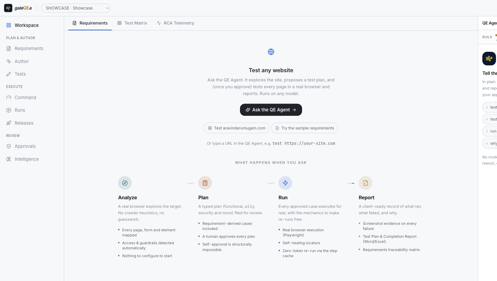
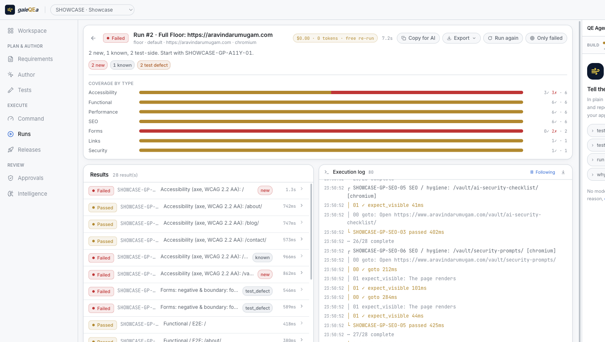
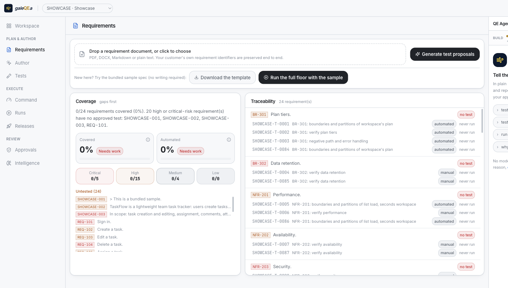
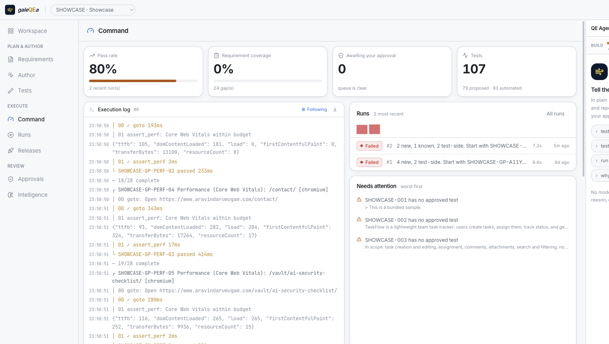

<div align="center">

# Gale QE Agent

<sub>`gale`**`QE`**`a` · the open-source **AI-first test automation agent**</sub>

[](https://securityscorecards.dev/viewer/?uri=github.com/mrviind/galeqea)

**Point it at any URL in plain English. It runs on any model, and won't burn a token to re-run.**

Describe what to test in plain English and the agent explores your app, plans, generates
the tests, and heals what breaks, driven by whatever LLM you already use (Anthropic,
OpenAI, Gemini, or a local model). It spends the model to **build and reason**; once a test exists,
**re-running it (execution, deterministic healing, scheduling, reporting) needs no model
and costs nothing.** Most AI-testing tools call the model on every run and meter you for it.
This one calls it to build, then re-runs for free.

[](LICENSE)
[](apps/api/tests)
[](#bring-your-own-model)
[](#your-cost-your-data)

<br />

**Point it at any URL → it explores, plans, tests in a real browser, and reports.**


<sub>The whole app, both themes: Workspace, Requirements, Run detail, Command, dark then light.</sub>

<picture>
  <source media="(prefers-color-scheme: dark)" srcset="docs/media/workspace-dark.png">
  
</picture>

</div>

---

## What makes this different

Every other AI-testing tool holds your model, your data, and your tests on their
cloud and meters you per run. GaleQEA makes different choices:

| | Choice | Why it matters |
|---|---|---|
| **1** | **Runs on any model, bring your own** | Anthropic, OpenAI, Gemini, Azure, a local Ollama, any OpenAI-compatible endpoint. No competitor lets you plug in your own LLM. Reuse the key you already pay for: no second AI bill, no vendor lock-in. |
| **2** | **Pay to build, not to re-run** | The model does the thinking: exploring, planning, generating tests, reasoning about failures, semantic healing. Execution, deterministic healing, scheduling and reporting need no model, so once a test exists, re-running it (nightly, on every deploy) calls no model and costs nothing. Most AI-testing tools bill you on every run; this one bills you to build. |
| **3** | **Tests are data, not code** | A test is an ordered list of typed steps, each carrying a *semantic intent* and a locator ladder. That is what makes the agent's output durable, replays deterministic, and export to Playwright/pytest/Robot/Gherkin a rendering problem instead of a rewrite. The tests are yours, on your disk. |
| **4** | **A persistent App Model** | GaleQEA maintains a digital twin of the application: screens, elements, and their locator history, **learned automatically from ordinary runs**. Heal an element **once** and every test that references it is repaired at the same moment, instead of patching the same button in forty tests, forty times. |
| **5** | **Healing is tiered, so it rarely costs a token** | Cached locator, then deterministic fingerprint scoring, then the model only as a last resort. A healthy suite heals for free; the LLM is spent where nothing cheaper can decide. |
| **6** | **The agent can't approve its own work** | Every change it proposes carries a reviewable diff and its evidence, and waits for a human. `SelfApprovalError` is enforced in code, not a setting you could turn off. |

---

## What's new

Recent, verified additions (see [CHANGELOG](CHANGELOG.md) for the full list):

- **Release management for test managers**: milestones with exit criteria, plans, cycles × configurations, a Go/No-Go **readiness** verdict computed from live metrics, and an immutable human **sign-off** (an AI principal can never sign).
- **Defects from failures**: one sentence or one click files a Jira/GitHub/GitLab issue from a red test, with reproduction, evidence attached, and **fingerprint dedupe** so a recurrence comments instead of duplicating.
- **Atlassian-first integrations**: import Jira stories → tests, push results to **Xray / Zephyr Scale / TestRail**, publish a **Confluence** release page, and get **Slack / Teams** notifications. Every external write passes the approval gate; credentials are vault-sealed.
- **Import from other tools**: Gherkin, TestRail/Xray/Zephyr **CSV**, and **JUnit** results become proposals or a run.
- **Tester ergonomics**: one-click **evidence bundles**, a keyboard manual runner, and timeboxed **exploratory (SBTM) sessions** from chat.

---

## Quick start

Clone, then one command does the rest: it installs the Python and Node
dependencies, downloads a Chromium, builds the UI, and launches on
**http://localhost:8080**.

```bash
git clone https://github.com/mrviind/galeqea && cd galeqea && make start
```

`make start` is the first-run command; after that it's just `make up`. Connect a
model in **Settings → Model** (any provider, or a local Ollama) to give the agent its
reasoning. The mechanical layer runs without one, so you can start immediately and
[add a model when you want](#bring-your-own-model).

Then paste a URL into the **Test any website** field on the home screen, or type it
in the chat:

```
test https://aravindarumugam.com
```

The agent opens it in a real browser, explores it, proposes a plan, and, once you
approve, tests it and reports back. (`aravindarumugam.com` is a real, consenting demo
target: swap in your own site.) From there everything else is a sentence away:

```
run smoke again          what's not tested?          why did the last run fail?
rerun only failed        which tests are flaky?      schedule regression nightly at 2am
```

None of those needs a model either.

<p align="center">
  <picture>
    <source media="(prefers-color-scheme: dark)" srcset="docs/media/run-detail-dark.png">
    
  </picture>
  <br /><sub>A run against a real site: coverage by type, the live log, and what it cost (nothing, to re-run).</sub>
</p>

**Docker instead:**

```bash
docker compose up          # SQLite, one container, one port
```

A container is reachable by more than just you, so it defaults to requiring a
login: watch the startup logs for a one-time setup link to set the admin
password, then sign in. For a solo local trial, skip that step entirely with:

```bash
GALEQEA_SINGLE_USER_MODE=true docker compose up
```

**Try it end to end** with the bundled application under test:

```bash
make demo    # serves examples/demo-app on :8765
```

---

## The workflow

Four ways in, one way through. Recording a session and importing an API
specification feed the same review board as requirement ingestion. The gate does
not make exceptions for the route a proposal arrived by.

```
  requirement document        a person using           OpenAPI
  DOCX · PDF · XLSX           the application          specification
          │                          │                       │
          ▼                          ▼                       ▼
  ┌────────────────┐        ┌────────────────┐      ┌────────────────┐
  │ Requirement    │        │ Session        │      │ Contract,      │
  │ Analyst        │        │ recorder       │      │ boundary, auth │
  │                │        │                │      │ and injection  │
  │ customer IDs   │        │ ladder per     │      │ cases derived  │
  │ preserved;     │        │ element;       │      │ from the schema│
  │ ambiguities    │        │ credentials    │      │ by rule, no    │
  │ raised, not    │        │ never read;    │      │ model used and │
  │ guessed at     │        │ noise collapsed│      │ none needed    │
  └───────┬────────┘        └───────┬────────┘      └───────┬────────┘
          ▼                         │                       │
  ┌────────────────┐                │                       │
  │ Test Designer  │                │                       │
  │                │                │                       │
  │ happy path,    │                │                       │
  │ negatives,     │                │                       │
  │ boundaries,    │                │                       │
  │ charters; near-│                │                       │
  │ duplicates     │                │                       │
  │ suppressed     │                │                       │
  └───────┬────────┘                │                       │
          │                         │                       │
          └─────────────┬───────────┴───────────────────────┘
                        ▼
        ╔═══════════════════════════════════╗
        ║           HUMAN REVIEW            ║  approve / reject / edit:
        ╚════════════════┬══════════════════╝  every proposal, with its
                         ▼                     rationale and provenance
           manual · exploratory · automated
                         │
                         ▼
        ┌────────────────────────────────┐   Playwright · live log
        │ Execution                      │   pause-and-attach when a human
        └────────────────┬───────────────┘   must clear a blocker
                         ▼
        ┌────────────────────────────────┐   new vs known vs flaky vs environment
        │ Triage · RCA                   │   evidence-cited hypotheses
        │ Healing · Coverage             │   heals proposed as reviewable diffs,
        └────────────────────────────────┘   never applied silently
```

---

## Feature map

<details>
<summary><b>Model & agents</b></summary>

- **Any model, your key**: Anthropic, OpenAI, Google Gemini, Azure OpenAI, a local
  Ollama, any OpenAI-compatible endpoint. Switching provider is a config change, the
  key is sealed in the local vault (the API returns only a hint, never the key), and
  a monthly budget is enforced *before* the spend. See [docs/AI.md](docs/AI.md).
- **Runs deterministically when it can**: execution, healing, triage, reporting and
  data generation resolve by rule, so the model is spent on judgment, not clicks.
  Add no model at all and the mechanical layer still runs.
- **Specialist roles**: Requirement Analyst, Test Designer, Script Generator,
  Executor, Explorer, Healer, RCA Analyst, Judge, Coverage Cartographer, Data Architect.
- **Bring your own agent** *(optional)*: bridge to a locally-installed coding-agent
  CLI you already run, so its credentials never pass through GaleQEA.
- **Inspectable memory**: every remembered fact is a row you can read, correct,
  export or delete.
- **Cost governor**: per-run token ceiling, step limit, and a usage ledger.

</details>

<details>
<summary><b>Execution engine</b></summary>

- Playwright across Chromium, Firefox and WebKit, in parallel.
- 30+ typed step actions including semantic assertions, accessibility checks,
  performance budgets, API requests, and **chaos injection** (network faults,
  offline mode, forced 5xx) to test how the UI degrades.
- **Accessibility-tree snapshots** as the agent's page representation: far cheaper
  in tokens than raw HTML and a better description of what a user can perceive.
- **Pause-and-attach handoff**: the browser parks mid-run so a person can clear an
  SSO prompt, an MFA challenge or a CAPTCHA, then hands control back.
- Playwright traces, screenshots, video, console and network capture on every run.

</details>

<details>
<summary><b>Requirements to tests, by technique</b></summary>

Boundary value analysis, equivalence partitioning, format partitioning and
decision tables, applied to the input domain the requirement states, **by rule
rather than by model**. `between 8 and 64 characters` yields 7/8/9 and 63/64/65
with the right verdicts on each; `one of Draft, Submitted, Approved` yields every
member plus an outsider; `if A and B and C` yields an eight-row decision table.

Every value names the technique that produced it, so a reviewer can judge it
rather than trust it. Boundary arithmetic is computed, never generated. Where the
requirement is silent (is enum matching case sensitive?), the value is marked
**unspecified** and raised as a question instead of being asserted either way.

A model, when configured, deepens this; it can never drop a requirement.
**Every requirement ends up with at least one test**, verified rather than assumed.

<p align="center">
  <picture>
    <source media="(prefers-color-scheme: dark)" srcset="docs/media/requirements-dark.png">
    
  </picture>
  <br /><sub>Every requirement traced to its tests, with the gaps surfaced first, not buried.</sub>
</p>

</details>

<details>
<summary><b>Session recording: a person drives, GaleQEA writes the test</b></summary>

A headed browser opens; use the application as a tester would; close it. What
comes out is **typed step data with a locator ladder**, not a code file.

`playwright codegen` writes source that is frozen the moment it is written. A
recorded GaleQEA test binds every element it touched into the App Model *as it is
touched*, so it is repairable before it has ever been run: heal the element once
and every test referencing it follows.

- **A ladder, not a selector.** Test id → role + accessible name → label →
  placeholder → text → structural CSS, best first. Ambiguous rungs get their index
  pinned. `composedPath()` is used, so a control inside a web component is captured
  as the control rather than as its shadow host.
- **Credentials are never captured.** Password inputs, credential and payment
  `autocomplete` targets, and secret-shaped field names are replaced with a
  generator reference *at the point of capture*. A value that is never read cannot
  leak into a database, an export or a log.
- **Alt+click to assert.** The one thing a recorder cannot infer from watching
  someone browse. Text containing a digit is not asserted, since an order number changes
  every run. A recording with no assertions says so in its rationale rather than
  inventing one.
- **Compression, conservatively.** Focus-only clicks, partial keystrokes, a submit
  that follows its own click and repeated navigations collapse; anything that would
  change what the test exercises is kept. The raw stream is stored alongside the
  compressed one, so a rule you disagree with is something you can argue with.
- A navigation *you caused* becomes an `expect_url` assertion, not another `goto`.
  URLs are stored as paths, so the test is not welded to one host.

See [docs/AUTHORING.md](docs/AUTHORING.md).

</details>

<details>
<summary><b>API contract testing from an OpenAPI specification</b></summary>

A spec already states the operations, the required parameters, their bounds, the
legitimate status codes and the shape of every response. Extracting a suite from
that needs no model, so it works in the default offline install.

Per operation: a **contract** test asserting the declared status *and* schema
conformance; a **required-missing** test per required parameter *and per required
body property*; **boundary and format** tests derived from `minLength`,
`maximum`, `enum` and `format`; an **unauthenticated** test wherever security is
declared; and **injection probes** that must be handled, not crashed on.

Response-schema conformance is the half hand-written API suites skip, and the half
that catches a backend quietly renaming a field. Violations name the pointer:
`$.items[2].price: expected number, got string`.

Three judgement calls worth knowing about:

- Tests point at the **project environment**, never the spec's `servers` entry. A
  published spec names production, and a generated suite with write operations and
  injection probes in it must not default there.
- **Reflection is only asserted for HTML responses.** A JSON API echoing a stored
  value back is correct; asserting against it would fail conformant services.
- **Remote `$ref` is refused, not fetched.** A specification is untrusted input,
  and dereferencing a URL inside it would let the document choose what this process
  connects to. Reference cycles are depth-bounded.

Spec defects (no declared 2xx, no response schema, unresolvable references) are
reported as limits on coverage rather than hidden.

</details>

<details>
<summary><b>Synthetic test data: reproducible and unroutable</b></summary>

Every value is a pure function of its seed, so a failure caused by an apostrophe
in a surname reproduces exactly. blake2b rather than `random.Random`, whose stream
is not stable across CPython versions.

Safe by construction, not by redaction: e-mail hosts come only from the RFC 2606 /
RFC 6761 reserved names; telephone numbers only from the ranges regulators reserve
for fiction (NANP `555-01xx`, Ofcom `07700 900xxx`); IP addresses from the RFC 5737
documentation range; and payment card numbers are Luhn-valid but carry major
industry identifier `9`, which ISO/IEC 7812 reserves for national assignment and no
scheme issues, so the number passes a checksum and can never reach a network.

Field kind is inferred from the declared type first, then the name in any casing;
`card code` is a CVV, `card expiry` is a date, and only then is a bare `card` a PAN.
Each kind also knows how it can be wrong, with the reason a reviewer needs.

</details>

<details>
<summary><b>Visual regression, structure first</b></summary>

Pixel diffing produces a red rectangle and a shrug: it cannot tell a font
hinting change from a missing checkout button, so teams learn to mute it.
GaleQEA compares three layers and only escalates when the cheap ones disagree:

1. **Structural**: diff the accessibility snapshots. Catches a vanished
   control, a renamed heading, changed body copy. Deterministic, offline, and
   immune to anti-aliasing.
2. **Perceptual**: region-based pixel comparison with an anti-aliasing
   tolerance, reporting *boxes* rather than a percentage. "The largest changed
   region is 656×112 at (400, 240)" is actionable; "0.9% of pixels differ" is not.
3. **Semantic judgement**: only when the first two disagree, a model says
   whether a user would care.

The ordering matters, and the numbers show why: removing a required field from
a checkout form changes **under 1% of the image**. Any pixel threshold loose
enough to tolerate anti-aliasing is also loose enough to miss it. But the
accessibility tree says plainly that a control disappeared, so it is graded
`breaking`.

Review is side-by-side with the changed regions boxed. Accepting records a new
baseline **version**; the previous one is kept. Screens that did not change are
recorded as auto-passed and stay out of the queue: a review list padded with
non-events is one people stop reading.

</details>

<details>
<summary><b>Autonomous exploratory testing</b></summary>

Give it a charter and a step budget; it drives a real browser in a
Plan-Act-Verify loop and reports findings a human triages.

- **Works with no model.** The deterministic strategy probes empty inputs with
  boundary values, follows links toward unseen screens, and finds console
  errors, 5xx responses, dead ends, unlabelled controls and silently discarded
  input. The model strategy adds judgement on top, choosing from a
  server-supplied candidate list so it can never invent a selector.
- **Refuses destructive controls outright**: delete, revoke, sign out, in every
  environment. Transactional controls (pay, place order) are blocked by default
  and unlockable per session, because on staging the submit button is where the
  behaviour is. Whatever it skips, it reports.
- **Every finding carries its reproduction**, so promoting one to a regression
  test is one click.
- **De-duplicated across sessions**, so exploring weekly does not file the same
  defect fifty-two times.

</details>

<details>
<summary><b>Suites & scheduling</b></summary>

- **Dynamic suites** are saved queries resolved at run time, so new matching
  tests join automatically; static suites are fixed lists.
- **Cron schedules** with a plain-English explanation shown *before* you save
  ("Runs every Monday at 18:00 UTC"), a next-fire time, pause/resume, and a
  Run-now that fires the real selection.
- Deleting a suite a live schedule depends on is refused: a schedule firing
  against nothing produces a green empty run, which looks like success.

</details>

<details>
<summary><b>Intelligence</b></summary>

- **Regression triage**: every failure classified as new / known / flaky /
  environment / test-defect, with the headline naming what to look at first.
- **Flaky detection**: same-commit disagreement, retry rescues, outcome entropy,
  healing pressure and duration variance. Score and *confidence* are reported
  separately, so a scary number from two runs is not mistaken for a verdict.
- **Predictive test selection**: ranks the suite against changed paths using
  learned correlations, and **lists in full what it omitted**.
- **Anomaly detection**: robust z-scores over median/MAD, so one pathological run
  cannot blind the detector.
- **LLM-as-judge**: sampled several times; disagreement lowers confidence and
  routes to a human rather than being averaged into false certainty.
- **RCA**: deterministic evidence gathering first (works with no model), then
  optional model ranking where every hypothesis must cite evidence by id.

</details>

<details>
<summary><b>Governance</b></summary>

- Configurable gates: per-action or batched, with risk tiers.
- Role-based access; a machine principal can never satisfy a gate.
- **Hash-chained audit ledger**: tamper-evident, verifiable end to end, exportable
  for compliance. `galeqea audit` reports the exact entry where a chain breaks.
- Envelope-encrypted vault; secret values are never returned by the API.
- Prompt-injection scanning on every untrusted document, surfaced to the user
  rather than silently stripped.

</details>

<details>
<summary><b>Integrations & extensibility</b></summary>

- **Test management**: push approved cases to **Xray**, **Zephyr Scale**,
  **Azure DevOps Test Plans** or **TestRail**. GaleQEA stores tests in the
  IEEE 829 shape all four implement, so export is translation, not
  reconstruction. See [docs/INTEGRATIONS.md](docs/INTEGRATIONS.md).
- **Jira** (REST v3) and **Xray Cloud**, including the 24-hour bearer-token refresh
  that trips up most integrations.
- **CI**: Jenkins, GitHub Actions, GitLab CI, Azure DevOps, plus direct upload of
  JUnit / Playwright / Allure reports for air-gapped installs.
- **Git**: GitHub, GitLab, Bitbucket. Ask the chat to
  `open a pull request with the approved checkout tests` and GaleQEA renders each
  approved test to a Playwright file and opens a **pull request**, never a direct
  commit, and only after the `git.open_pr` approval is granted. The AI proposes the
  PR; a human lets it out.
- **MCP server**: the same tool registry that powers the built-in chat, exposed to
  Claude Code, Cursor and VS Code. See [docs/MCP.md](docs/MCP.md).
- **Plugin SDK**: manifest-based, capability-scoped, hot-loadable. See
  [examples/plugins](examples/plugins).

</details>

---

## Your cost, your data

The model earns its keep on the **thinking**: exploring a site, planning, generating
tests, reasoning about a failure, and semantic locator healing. Everything else,
**running** the tests, deterministic healing, scheduling, flake detection, triage,
reporting, and the audit ledger, runs by rule, with no model. What follows, which no
cloud-metered competitor can match:

- **You pay to build a test, never to re-run it.** Building and reasoning call *your*
  provider, metered by you, capped by a monthly budget enforced *before* the spend.
  But a nightly regression, a re-run on every deploy, a scheduled suite: those call no
  model and cost nothing, forever. (Point the building at a local model and even that
  is free.) The token-per-action tools bill you on every single run.
- **Nothing leaves your machine unless you aim it at a cloud model.** No telemetry,
  ever. Run the building on a local model, or none at all, and it's genuinely
  air-gappable: the whole run-heal-report loop never needs the network.
- **The tests, the App Model, and the ledger all live on your disk.** Export to standard
  Playwright / pytest / Robot / Gherkin any time. Nothing holds them hostage.

<p align="center">
  <picture>
    <source media="(prefers-color-scheme: dark)" srcset="docs/media/command-dark.png">
    
  </picture>
  <br /><sub>One dashboard for pass rate, coverage, what's awaiting review, and what's running right now.</sub>
</p>

---

## Bring your own model

Point GaleQEA at whatever LLM you already use: Anthropic, OpenAI, Gemini, Azure, a
local Ollama, or any OpenAI-compatible endpoint. The key is sealed in the local vault,
scoped per project, and capped by a monthly budget enforced before the spend; the API
returns only a hint, never the key.

Prefer to drive a coding-agent CLI you have already installed and authenticated? An
optional local bridge shells out to it as if you had typed the command; its
credentials never pass through GaleQEA, and it runs only when the server is bound to
loopback.

---

## Architecture

```
apps/
  api/        Python · FastAPI · SQLAlchemy · SQLite or Postgres
    galeqea/
      core/          approval gate · hash-chained audit · vault · injection defence
      ai/            provider abstraction · agents · tool registry · memory · router
      engine/        plan compiler · run supervisor · healing · ingestion · codegen
      intelligence/  triage · flakiness · RCA · selection · anomalies · judge · coverage
      integrations/  Jira · Xray · CI providers · Git providers
      mcp_server/    MCP tools, resources and prompts
      plugins/       SDK and capability-scoped loader
  runner/     Node · Playwright executor speaking an NDJSON control protocol
  web/        React · TypeScript · Vite · Tailwind v4
```

Read [ARCHITECTURE.md](ARCHITECTURE.md) for the design decisions and their reasoning.

---

## Documentation

| | |
|---|---|
| [ARCHITECTURE.md](ARCHITECTURE.md) | Design decisions, and why each one was made |
| [docs/MCP.md](docs/MCP.md) | Using GaleQEA from Claude Code, Cursor or VS Code |
| [docs/PLUGINS.md](docs/PLUGINS.md) | Writing a plugin |
| [docs/CI.md](docs/CI.md) | Running GaleQEA in CI |
| [docs/AI.md](docs/AI.md) | How requirements become tests, and bring-your-own-key |
| [docs/AUTHORING.md](docs/AUTHORING.md) | Session recording, API specification import, synthetic test data |
| [docs/INTEGRATIONS.md](docs/INTEGRATIONS.md) | Exporting test cases to Xray, Zephyr, Azure DevOps, TestRail |
| [CONTRIBUTING.md](CONTRIBUTING.md) | Contributor guide: dev setup, Conventional Commits, DCO, the AI-code review gate |
| [SECURITY.md](SECURITY.md) | Threat model and vulnerability reporting |
| [SUPPORT.md](SUPPORT.md) | Where to ask questions vs. file bugs |
| [CODE_OF_CONDUCT.md](CODE_OF_CONDUCT.md) | Contributor Covenant 2.1 |
| [CHANGELOG.md](CHANGELOG.md) | Notable changes, per release |
| [RELEASING.md](RELEASING.md) | How releases are cut from commit history |
| [docs/brand](docs/brand/README.md) | The mark, the palette, and why the brand spends no colour |

---

## Commands

```bash
galeqea up                       # start everything on :8080
galeqea doctor                   # check the install; say what to fix
galeqea run "the smoke tests"    # run from a terminal or CI (non-zero exit on failure)
galeqea run --changed src/checkout.ts,src/api.ts   # predictive selection
galeqea export DEMO-T-0001 --target playwright     # standalone runnable source
galeqea audit --verify-only      # verify the ledger's hash chain
galeqea mcp                      # MCP server over stdio
galeqea plugins --install ./my-plugin
```

---

## Licence

Apache-2.0, a permissive licence with an explicit patent grant, chosen because this
project expects corporate contributors and integrations. Contributions are accepted
under the [DCO](CONTRIBUTING.md#developer-certificate-of-origin).

All code in this repository is original work.
