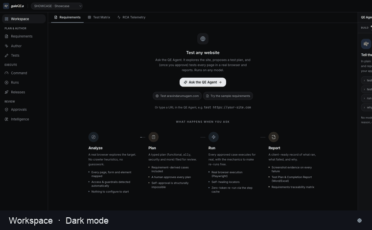

# The golden path: twelve stages, one journey

Every target you point GaleQEA at travels the same rail. Nothing is hidden: you
always see which stage it is in, what it skipped and why, and where a human
decision is required. This page walks the whole arc.

> Try it end to end: `make demo` serves the bundled app on `:8765`, then in the
> chat say **`test http://localhost:8765`** and watch the rail advance.

---

## The rail

| # | Stage | What happens | What you decide |
|---|-------|--------------|-----------------|
| 01 | **Target** | You give a URL (or upload a requirements doc / OpenAPI spec) and say what to test, in plain English. | The scope. |
| 02 | **Access** | If the app needs a login, credentials are taken through a secure form and sealed in the vault, never in the chat transcript. | Whether to sign in, and as whom. |
| 03 | **Guardrails** | Scope and no-go rules are set: which hosts are in bounds, whether transactional actions (checkout, delete) are allowed. | The boundaries. |
| 04 | **Explore** | The agent drives the app in a real browser, building a map of screens and elements (the App Model) learned from ordinary navigation. | Nothing; it reads, never writes. |
| 05 | **Plan** | It proposes a test plan: which flows, which of the [fifteen kinds of test](AUTHORING.md), at what priority. Each proposal carries its rationale. | **Approve the plan** (or edit it). |
| 06 | **Build** | Approved proposals become real, versioned tests: ordered typed steps with a semantic intent and a locator ladder, so they stay healable. | Review in the board. |
| 07 | **Smoke** | A fast subset runs first, to catch a broken environment before spending a full suite. | None |
| 08 | **Run** | The full selection executes across the configured browsers and viewports, in real Chromium/Firefox/WebKit. | None |
| 09 | **Triage** | Each result is classified: new vs known vs flaky vs environmental. Failures get a fingerprint so a recurrence is recognised, not re-reported. | File a bug (one click → a tracked issue with evidence). |
| 10 | **Readiness** | For a release, exit criteria (pass rate, coverage, open blockers, flaky rate) are evaluated against live metrics into a **Go / No-Go** verdict. | **Sign off**: human-only, immutable; an AI principal can never sign. |
| 11 | **Report** | Everything is rendered as `report.json` / `report.md` / `report.junit.xml`, plus coverage, traceability, flaky and RCA reports, each with a stable schema. | Share, export, or publish to Confluence. |
| 12 | **Keep green** | Scheduled re-runs, deterministic healing of known breaks, and notifications keep the suite honest over time, **with no model, so it costs nothing**. | Set a schedule; wire Slack/Teams. |

---

## The two rules that hold at every stage

1. **The agent can't approve its own work.** Every state-changing step (building a
   test, applying a heal, filing a bug, pushing results, signing off a release)
   is a *proposal* a human accepts. `SelfApprovalError` is enforced in code, not a
   setting. Stages 05, 09, 10 are the visible gates; the rest of the writes queue
   in the Approvals view.

2. **Pay to build, not to re-run.** The model is spent on the thinking stages
   (Explore, Plan, Build, Triage/RCA, semantic healing). Execution, deterministic
   healing, scheduling and reporting need no model, so once a test exists,
   re-running it forever (stages 07–08, 11–12) calls no model and costs nothing.

---

## Where the rail shows up

- **In the chat**: the [rail](../apps/web/src/components/JourneyRail.tsx) is drawn in the header and on each stage card, so you always see where the target is.
- **On the Releases page**: stages 10–11 as milestones, cycles, readiness and sign-off.
- **In every report**: `readiness` and `metrics` blocks reflect stages 09–11.

For the design-technique detail behind stage 05 (boundary, partition,
decision-table, negative and contract tests), see [AUTHORING.md](AUTHORING.md).
For pushing results and publishing reports outward (stages 09–11), see
[INTEGRATIONS.md](INTEGRATIONS.md).
