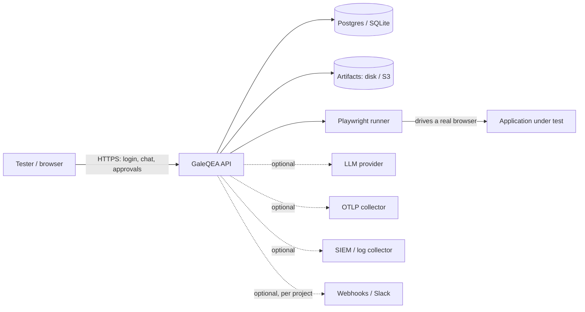

# Data flow

What data GaleQEA holds, where it goes, and what leaves the deployment.

## What is stored

| Data | Where | Notes |
| --- | --- | --- |
| Users, roles, sessions | DB | passwords are argon2id; session is a JWT cookie |
| API tokens | DB | only a SHA-256 hash, never the plaintext |
| Credentials for the app-under-test | DB **vault** (encrypted) | never logged or returned |
| Tests, runs, results, reports | DB | your test assets |
| Screenshots / video / trace / logs | disk or S3 | expire via `retention_days` |
| Audit ledger | DB | append-only, hash-chained |

## What leaves the deployment

Nothing leaves by default; GaleQEA runs fully offline. Outbound traffic happens
**only** when an operator configures it:

- **LLM provider**: only if a model is configured (`ai_mode != no_ai`). Prompts and
  page context are sent to the provider you choose; with `no_ai` there is zero
  outbound AI traffic. See [sub-processors.md](sub-processors.md).
- **Telemetry**: off by default and off forever unless explicitly enabled.
- **Webhooks / OTLP / SIEM**: only to endpoints you configure.
- **The application under test**: the runner navigates the target URLs you point it at.

Secrets (LLM keys, app credentials) are sealed in the vault and never appear in logs,
reports, the audit ledger, webhooks, or the database in clear text.
